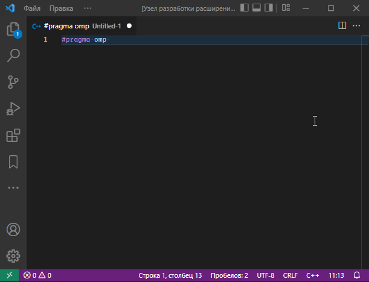

# OpenMP pragma code completion proposals for Visual Studio Code

This extension adds code completion proposals for OpenMP's pragma into Visual Studio Code.

## Features

### Code completion proposals

### Reference for directive/clause

> Based on [Microsoft reference](https://docs.microsoft.com/en-us/cpp/parallel/openmp/2-directives)

## Extension Settings

This extension contributes the following settings:

* `omp-pragma.scheduleMaxChunkSize`: Item count for *schedule* `chunk_size`
* `omp-pragma.helpLang`: Reference language

## Release Notes

### 1.0.0

Initial release